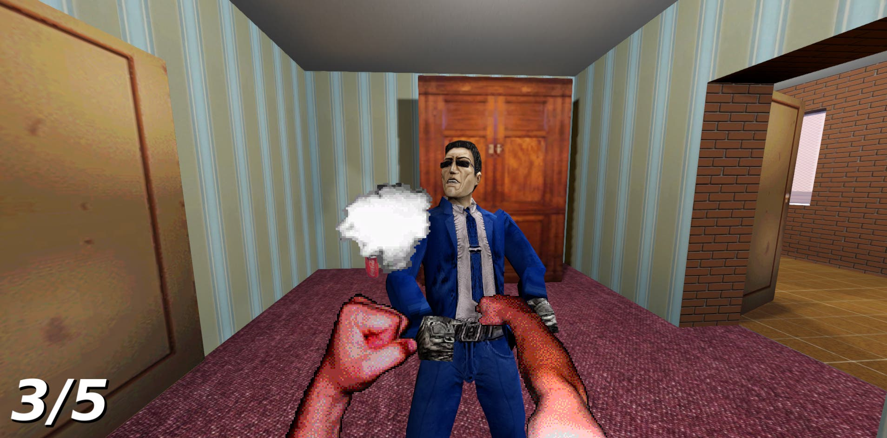
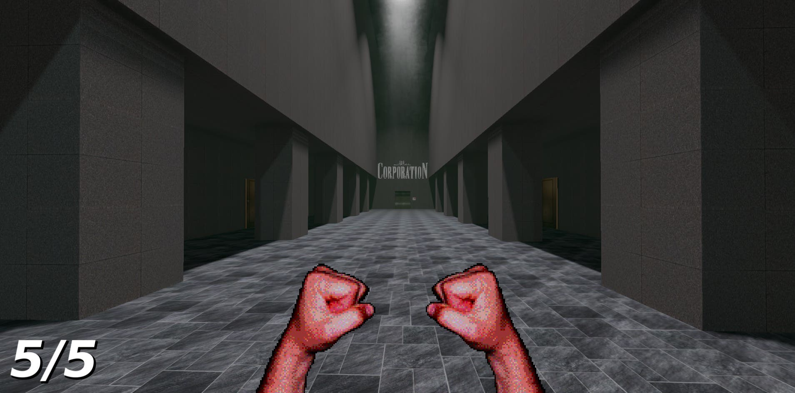

# GET THAT CD BACK

**In the year 20XX corporations think they own everything, and now they came for your old CDs. It's time for fists-on approach to media preservation.**

First person brawler made entirely with DiscMaster assets for DiscMaster Jam. Made in 1 week.

 

# Assets used
All assets used in the project come from [DiscMaster collection](https://discmaster.textfiles.com/). Full list of sources can be found in [sources.txt](/sources.txt).

# Credits

Game by Punished Bernadetta (Dimitri Sukhankin)
With help from blahajfish

Made for [DiscMaster Jam](https://itch.io/jam/discmaster-jam)

Game uses
* [Godot](https://godotengine.org/)
* [Cyclops Level Builder](https://github.com/blackears/cyclopsLevelBuilder)
* [Starter Kit FPS](https://github.com/KenneyNL/Starter-Kit-FPS)

Thank you to everyone who played my game.
